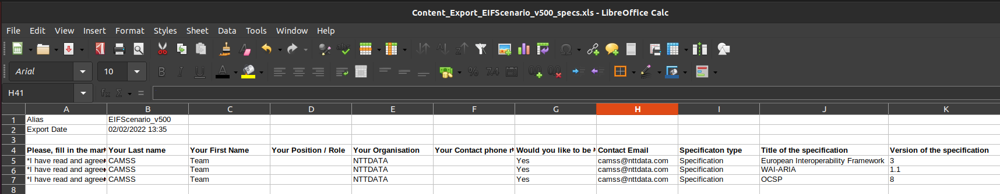

<h1>
CAMSS Utilities
</h1>
<h1>
Transformation of the CAMSS Assessments, from spread-sheets to RDFs
</h1>
<h2>
Compatible with EIF(v5), MSP(v1) and TS(v1) CAMSS Tools
</h2>

European Commission, ISA2 Programme, DIGIT

<a href="mailto:camss@everis.com">camss@everis.nttdata.com</a>

<a href="https://joinup.ec.europa.eu/collection/eupl/about">UPL Licence</a>

Build 20220118T18:00

Version 1.2

<h2>arti folder</h2> 

The arti folder should contain the 'in' (input) and 'out' (output) folders. The 'in' folder will contain:
	<ul>
		<li><b>'in' folder:</b> the user must create a folder named 'in'; once the 'in' folder has been created, the user has to create three other folders named 'EIF500', 'MSP400' and 'TS400' that will contain the EUSurvey output in XLS format: 		

</li>

		
		<li><b>'out' folder:</b> the RDF Conversor will automatically create a folder named 'out'; inside the 'out' folder, three other folders named 'ass', 'crit' and 'specs' will contain the populated CAMSS Knowledge Graphs in different RDF formats, that is, the CAMSS Assessments Graphs, the CAMSS Scenarios and Critera Graphs and the Specifications Graphs, respectively.</li>
	</ul>

